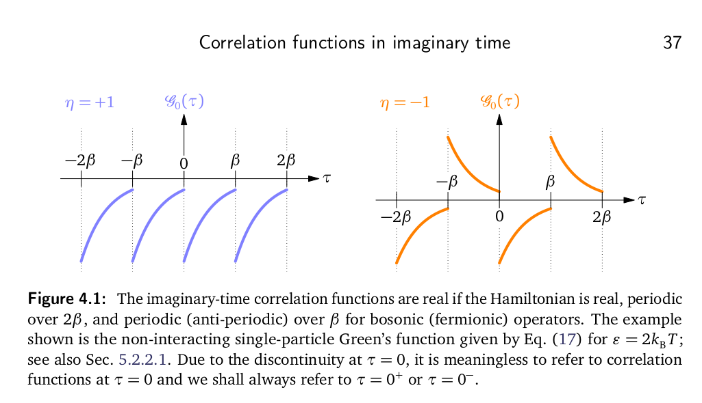

# Derivations

Here we will derive properties of correlation functions in imaginary time and their spectral functions. If you find an error in this page please report an issue via github or email [James Neuhaus](mailto:jneuhau1@utk.edu). 

Conventions: $\hbar=1$, for $\pm,\mp$ top signs are for bosonic correlations, bottom signs fermionic

Causal Matsubara correlation functions are defined such that for operators $\hat{A},\hat{B}$ the correlation function is 
```math
C_{AB}(\tau -\tau')=-\langle T_{\tau}A(\tau)B(\tau')\rangle=-\Theta(\tau-\tau')\langle A(\tau)B(\tau')\rangle \mp \Theta(\tau'-\tau)\langle B(\tau')A(\tau)\rangle 
```

By using translational symmetry we can set $\tau'=0$ which we will do going forward.

## Periodicity

Starting from $\tau > 0$ we have
```math
\begin{align*}
C_{AB}\left(\tau>0\right)=-\langle A\left(\tau\right)B\left(0\right)\rangle= & -\frac{1}{Z}Tr\left[e^{-\beta H}e^{\tau H}Ae^{-\tau H}B\right]\\
= & -\frac{1}{Z}Tr\left[Be^{-\beta H}e^{\tau H}Ae^{-\tau H}\right]\\
= & -\frac{1}{Z}Tr\left[Be^{-\beta H}e^{\tau H}Ae^{-\tau H}\left(e^{\beta H}e^{-\beta H}\right)\right]\\
= & -\frac{1}{Z}Tr\left[e^{-\beta H}Be^{-\beta H}e^{\tau H}Ae^{-\tau H}e^{\beta H}\right]\\
= & -\frac{1}{Z}Tr\left[e^{-\beta H}Be^{\left(\tau-\beta\right)H}Ae^{-\left(\tau-\beta\right)H}\right]\\
= & -\langle B\left(0\right)A\left(\tau-\beta\right)\rangle\\
= & \pm\langle T_{\tau}A\left(\tau-\beta\right)B\left(0\right)\rangle\\
= & \pm C_{AB}\left(\tau-\beta\right)
\end{align*}
```

Thus, correlation functions take on the patterns:


*[Cristophe Berthod](https://giamarchi.unige.ch/wp-content/php_code/people/christophe.berthod/pdf/Many-body.pdf)*

## Reflection Symmetry
### Correlation Functions
Let us look at correlation functions with the operator order flipped

```math
\begin{align*}
C_{BA}\left(\tau\right)= & -\Theta\left(\tau\right)\left\langle B\left(\tau\right)A\left(0\right)\right\rangle \mp\Theta\left(-\tau\right)\left\langle A\left(0\right)B\left(\tau\right)\right\rangle \\
= & -\frac{\Theta\left(\tau\right)}{Z}Tr\left[e^{-\beta H}e^{\tau H}Be^{-\tau H}A\right]\mp\frac{\Theta\left(-\tau\right)}{Z}Tr\left[e^{-\beta H}Ae^{\tau H}Be^{-\tau H}\right]\\
= & -\frac{\Theta\left(\tau\right)}{Z}Tr\left[e^{-\beta H}e^{\beta H}e^{-\tau H}Ae^{-\beta H}e^{\tau H}B\right]\mp\frac{\Theta\left(-\tau\right)}{Z}Tr\left[e^{-\beta H}Ae^{\tau H}e^{\beta H}e^{-\beta H}Be^{-\tau H}\right]\\
= & -\frac{\Theta\left(\tau\right)}{Z}Tr\left[e^{-\beta H}e^{\beta H}e^{-\tau H}Ae^{-\beta H}e^{\tau H}B\right]\mp\frac{\Theta\left(-\tau\right)}{Z}Tr\left[e^{-\beta H}Be^{-\tau H}e^{-\beta H}Ae^{\tau H}e^{\beta H}\right]\\
= & -\frac{\Theta\left(\tau\right)}{Z}Tr\left[e^{-\beta H}e^{\left(\beta-\tau\right)H}Ae^{-\left(\beta-\tau\right)H}e^{\tau H}B\right]\mp\frac{\Theta\left(-\tau\right)}{Z}Tr\left[e^{-\beta H}Be^{-\left(\beta+\tau\right)H}Ae^{\left(\beta+\tau\right)H}\right]\\
= & -\Theta\left(\tau\right)\left\langle A\left(\beta-\tau\right)B\left(0\right)\right\rangle \mp\Theta\left(-\tau\right)\left\langle B\left(-\beta-\tau\right)A\left(0\right)\right\rangle \\
= & \pm C_{AB}\left(\beta-\tau\right)
\end{align*}
```

It follows that in the case where the two operators are the same, $B=A$, this expression becomes $C_{AA}\left(\tau\right)=\pm C_{AA}\left(\beta-\tau\right)$. Thus, a symmetrized/antisymmetrized kernel is needed.

### Spectral Functions

We define our spectral function as
```math
\begin{align*}
\rho_{AB}\left(\omega\right)= & \frac{2\pi}{Z}\left(1\mp e^{-\beta\omega}\right)\sum_{n,m}e^{-\beta E_{n}}\left\langle m\left|\hat{A}\right|n\right\rangle \left\langle n\left|\hat{B}\right|m\right\rangle \delta\left(\omega+E_{m}-E_{n}\right)
\end{align*}
```

We will swap indices and then take $\omega\rightarrow -\omega$
```math
\begin{align*}
\rho_{AB}\left(\omega\right)= & \frac{2\pi}{Z}\left(1\mp e^{-\beta\omega}\right)\sum_{n,m}e^{-\beta E_{n}}\left\langle m\left|\hat{A}\right|n\right\rangle \left\langle n\left|\hat{B}\right|m\right\rangle \delta\left(\omega+E_{m}-E_{n}\right)\\
= & -\frac{2\pi}{Z}\left(1\mp e^{-\beta\omega}\right)\sum_{n,m}e^{-\beta E_{m}}\left\langle n\left|\hat{B}\right|m\right\rangle \left\langle m\left|\hat{A}\right|n\right\rangle \delta\left(\omega+E_{n}-E_{m}\right)\\
= & -\rho_{BA}\left(-\omega\right)
\end{align*}
```

For both fermions and bosons we pick up a minus sign for two different reasons: bosons because of the inverted Bose factor $1-e^{-\beta\omega}\rightarrow e^{-\beta\omega}-1$ and the fermion case's sign flips from the operator order flip. 

In the case of $A=B$ we get $\rho(\omega)=-\rho(\omega)$

## Kernels for $\tau\rightarrow\omega$

Spectral functions are defined in such a way as to reflect what is
measured in experiment. For example, let's look at the correlation
function which is also the electron Green's function
```math
\begin{align*}
G_{\alpha\beta}\left(\tau\right)= & -\left\langle T_{\tau}a_{\alpha}\left(\tau\right)a_{\beta}^{\dagger}\left(0\right)\right\rangle 
\end{align*}
```

This relates back to the spectral function for the electron occupation
energies through the relation
```math
\begin{align*}
G\left(\mathbf{k},\sigma,\tau>0\right)= & -\left\langle c_{\mathbf{k},\sigma}\left(\tau\right)c_{\mathbf{k},\sigma}^{\dagger}\left(0\right)\right\rangle \\
= & -\frac{1}{Z}\sum_{n}\left\langle n\left|e^{-\beta H}e^{\tau H}c_{\mathbf{k},\sigma}e^{-\tau H}c_{\mathbf{k},\sigma}^{\dagger}\right|n\right\rangle \\
= & -\frac{1}{Z}\sum_{n}e^{-\beta E_{n}}e^{\tau E_{n}}\left\langle n\left|c_{\mathbf{k},\sigma}e^{-\tau H}c_{\mathbf{k},\sigma}^{\dagger}\right|n\right\rangle \\
= & -\frac{1}{Z}\sum_{m,n}e^{-\beta E_{n}}e^{\tau\left(E_{n}-E_{m}\right)}\left\langle n\left|c_{\mathbf{k},\sigma}\right|m\right\rangle \left\langle m\left|c_{\mathbf{k},\sigma}^{\dagger}\right|n\right\rangle \\
= & -\frac{1}{Z}\sum_{m,n}e^{-\beta E_{n}}e^{\tau\left(E_{n}-E_{m}\right)}\left|\left\langle m\left|c_{\mathbf{k},\sigma}^{\dagger}\right|n\right\rangle \right|^{2}\\
= & -\int_{-\infty}^{\infty}\frac{d\omega}{\pi}\frac{e^{-\omega\tau}}{1+e^{-\beta\omega}}\Im G\left(\mathbf{k},\sigma,\omega\right)\\
= & \int_{-\infty}^{\infty} d\omega \frac{e^{-\omega\tau}}{1+e^{-\beta\omega}}A\left(\mathbf{k},\sigma,\omega\right)\\
\end{align*}
```

This gives us the fermionic kernel of $\frac{e^{-\omega\tau}}{1+e^{-\beta\omega}}$. Doing the same treatment for antisymmetric fermionic correlations, bosonic correlations, and symmetric bosonic correlations we get the following kernels:
```math
\begin{align*}
K_{fermion}\left(\omega,\tau\right)= & \frac{e^{-\tau\omega}}{1+e^{-\beta\omega}}\\
K_{fermion,antisym}\left(\omega,\tau\right)= & \frac{1}{2}\frac{e^{-\tau\omega}-e^{-\left(\beta-\tau\right)\omega}}{1+e^{-\beta\omega}}\\
K_{boson,asym}\left(\omega,\tau\right)= & \frac{e^{-\tau\omega}}{1-e^{-\beta\omega}}\\
K_{boson,sym}\left(\omega,\tau\right)= & \frac{e^{-\tau\omega}+e^{-\left(\beta-\tau\right)}}{1-e^{-\beta\omega}}
\end{align*}
```

### Bosonic Kernel Modifications for AC methods

For kernel functions odd about $\omega=0$ most AC codes will pull a factor of $\omega$ into the kernel. This makes the kernel analytic on the entire $\omega$ line but AC will give you $\frac{\rho(\omega)}{\omega}$. Some codes will return this value. DEAC.jl handles this in the back end and reports only $\rho(\omega)$.

## Normalization

For the fermionic non-symmetric case it is simple to tell the zeroth moment of the spectral function
```math
\begin{align*}
C_{AB}\left(0\right)+C_{AB}\left(\beta\right)= & \int d\omega A\left(\omega\right)\frac{e^{-0\omega}+e^{-\beta\omega}}{1+e^{-\beta\omega}}\\
C_{AB}\left(0\right)+C_{AB}\left(\beta\right)= & \int d\omega A\left(\omega\right)
\end{align*}
```

For any others there is no obvious way to derive the zeroth moment. 
